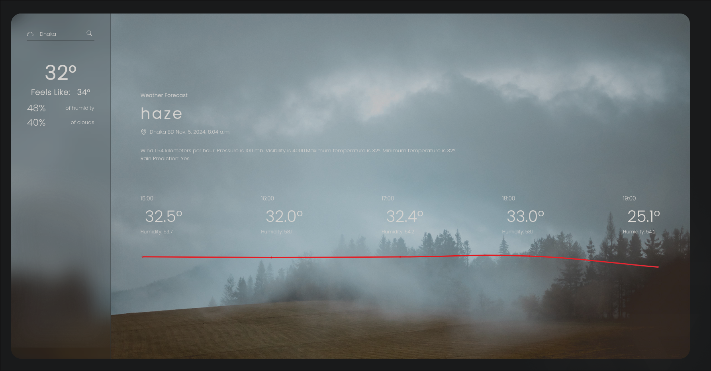

# Weather Forecasting Project

This project leverages machine learning to predict weather patterns, including rain forecasts and future temperature/humidity predictions, and displays them via a Django web interface.

 <!-- Adjust the path accordingly -->

## How to Run the Project

You can run the project using **Docker** or **Python**.

### Option 1: Using Docker

1. Clone the repository:
   ```bash
   git clone https://github.com/akibahmed229/WeatherForecasting
   ```
2. Navigate to the project directory:
   ```bash
   cd WeatherForecasting
   ```
3. Build and run the Docker container:
   ```bash
   docker compose up
   ```

### Option 2: Using Python

1. Set up a virtual environment:

   ```bash
   python -m venv ./venv
   ```

2. Activate the virtual environment:

   - **Linux/macOS**:
     ```bash
     source ./venv/bin/activate
     ```
   - **Windows**:
     ```bash
     .\venv\Scripts\activate
     ```

3. Install the required dependencies:

   ```bash
   pip install -r requirements.txt
   ```

4. Run the Django server:
   ```bash
   python manage.py runserver
   ```

### Access the Application

Once the server is running, you can access the application at:

```
http://localhost:8000
```
